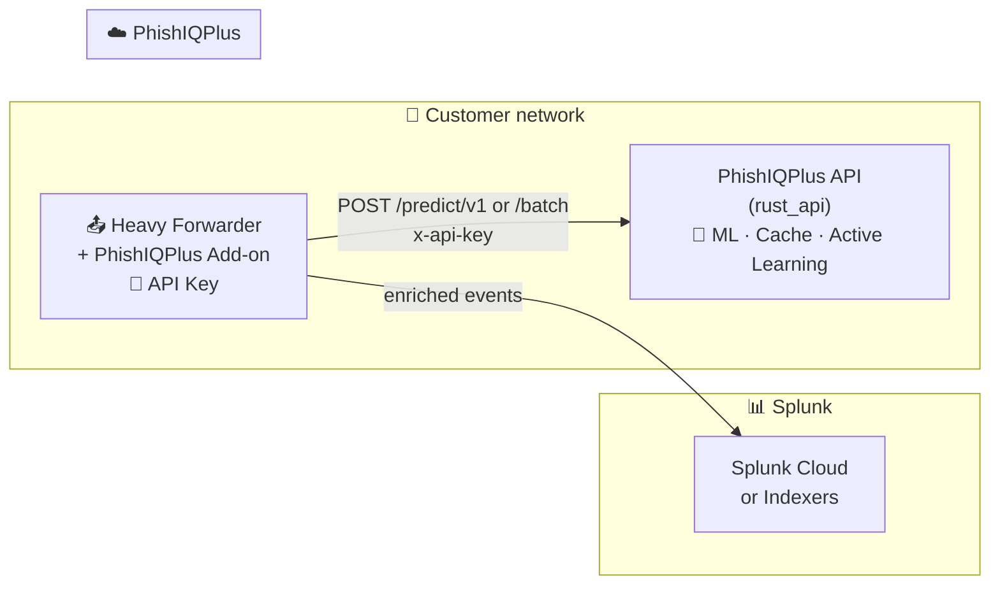

# 🛡️ PhishIQPlus Technical Add-on for Splunk

> **URL phishing enrichment** via PhishIQPlus API. Designed for **Heavy Forwarder** deployment (external enrichment to Splunk Cloud).

---

## 🏗️ Architecture (Enterprise-Ready External Enrichment)

### High-level flow

```
     ┌───────────────────────────────────────────────────────────────────────────┐
     │  🏢 CUSTOMER NETWORK (On-Prem or VM in cloud)                             │
     │                                                                            │
     │    ┌─────────────────────────┐         ┌─────────────────────────┐        │
     │    │  📤 Heavy Forwarder     │  HTTP   │  ☁️  PhishIQPlus API     │        │
     │    │  + PhishIQPlus Add-on   │ ──────► │  (rust_api / Cloud Run) │        │
     │    │  🔐 API Key stored here │         │  🧠 ML + Active Learning │        │
     │    └────────────┬────────────┘         └─────────────────────────┘        │
     │                 │                                                          │
     │                 │  enriched events (phishiq_* fields)                       │
     └─────────────────┼──────────────────────────────────────────────────────────┘
                       │
                       ▼
              ┌─────────────────────┐
              │  📊 Splunk Cloud     │
              │  (or on-prem indexers)│
              └─────────────────────┘
```

### Mermaid diagram (renders in GitHub / many Markdown viewers)



### ✅ Why this architecture

| Benefit | Description |
|--------|--------------|
| 🔒 **No Cloud egress** | All API calls run **outside** Splunk Cloud → no third-party egress approval. |
| 🔐 **Credentials on HF** | The API key (the service-consuming license credential) and config live on the Heavy Forwarder; use Splunk credential store. |
| 📈 **Scalable** | Batch + cache reduce API load; run on a dedicated HF for high volume. |

---

## 🧩 Enterprise Components

| Component | Purpose | Status |
|-----------|---------|--------|
| `phishiqplus_enrichment` modular input (batch) | Scheduled enrichment from `url_list` | Implemented |
| `phishiqplus_enrichment` modular input (dynamic) | Pull URLs from Splunk events via `source_search` and `source_url_field` | Implemented |
| `phishiqplus` custom search command | Enrich URLs in search pipelines (`| phishiqplus`) | Implemented |
| `PhishIQPlus - Manual Test` dashboard | Analyst validation for one URL from Splunk UI | Implemented |
| `PhishIQPlus - Correlation` dashboard | Analyst traceability from enriched event to source event context | Implemented |
| Internal telemetry index (`phishiqplus_internal`) | Health/performance/cache visibility | Implemented |
| `macros.conf` + `savedsearches.conf` | Reusable SOC searches and hourly correlation coverage checks | Implemented |
| `props.conf` + `transforms.conf` | Parsing hardening and backup hash extraction | Implemented |
| `ENTERPRISE_HANDOVER.md` | Delivery checklist for production rollout and rollback readiness | Implemented |

---

## 📥 Installation

| Step | Action |
|------|--------|
| 1️⃣ | Copy this app to `$SPLUNK_HOME/etc/apps/` (or deploy via deployment server). |
| 2️⃣ | Restart Splunk or reload the app. |
| 3️⃣ | **Settings → Data inputs → PhishIQPlus URL Enrichment** (modular input). |
| 4️⃣ | Set **API Base URL** and **API Key**. Optionally set **API Key Name**. |
| 5️⃣ | Optional: enable cache, set schedule, index, and sourcetype. |

---

## ⚙️ Configuration (Modular Input)

| Field | Description |
|-------|-------------|
| 🌐 **API Base URL** | PhishIQPlus API base (e.g. `https://phishiqplus-api-xxx.run.app`) |
| 🔑 **API Key** | Required service-consuming license credential from PhishIQPlus (**stored encrypted in Splunk credential store**) |
| 🏷️ **API Key Name** | Optional display label for the license (e.g. Enterprise 1M) |
| ⏱️ **Request Timeout** | Seconds for API calls (default 30) |
| 🔒 **SSL Verify** | Verify TLS certificate (default true) |
| 🔄 **Mode** | `batch` (scheduled URL list) or `dynamic` (search-driven URL extraction) |
| 🔎 **Dynamic Source Search** | SPL query used by dynamic mode to read candidate events |
| 🔗 **Dynamic URL Field** | Field containing URL in source events (default: `url`) |
| 🧷 **Dynamic Checkpoint Overlap** | Overlap window in seconds to avoid misses around schedule boundaries |
| 📦 **Dynamic Batch Controls** | `source_search_batch_size`, `source_search_max_urls`, throttle sleep between batches |
| 🧹 **URL Quality Guardrails** | Canonicalization + invalid URL filtering before API calls |
| 🔗 **Source Correlation** | Optional source metadata + stable source hash per enriched event |
| 📅 **Schedule** | Interval for modular input run (e.g. every 10 min) |
| 📂 **Index / Source Type** | Where to write enriched events |
| 📝 **URL List (batch)** | One URL per line for batch mode |
| 💾 **Cache** (Enabled / TTL / Max) | Local cache to reduce API calls |

---

## 📋 Enriched Event Fields

| Field | Meaning |
|-------|---------|
| `phishiq_prediction` | 0 = safe ✅ · 1 = phishing 🚨 |
| `phishiq_source` | e.g. Model, Cache, IOC |
| `phishiq_confidence` | 0.0–1.0 |
| `phishiq_risk_level` | LOW · MEDIUM · HIGH · NEUTRAL |
| `phishiq_cached` | Whether result was from cache |
| `phishiq_domain` | Domain from details |
| `phishiq_analysis_time` | Analysis timestamp |
| `phishiq_original_url` | Optional original URL before normalization (when enabled) |
| `phishiq_source_event_time` | Source event `_time` (dynamic mode) |
| `phishiq_source_event_host` | Source event `host` (dynamic mode) |
| `phishiq_source_event_source` | Source event `source` (dynamic mode) |
| `phishiq_source_event_sourcetype` | Source event `sourcetype` (dynamic mode) |
| `phishiq_source_event_hash` | Stable correlation hash for join/debug workflows |

---

## 🔌 API Endpoints Used

| Method | Endpoint | Purpose |
|--------|----------|---------|
| 📤 **Single** | `POST /predict/v1` | Body: `{"url": "..."}` · Header: `x-api-key` |
| 📤 **Batch** | `POST /predict/v1/batch` | Body: `{"urls": ["...", ...], "fast_mode": false}` · Header: `x-api-key` |

---

## 📌 Requirements

- **Splunk** 8.x+ (Python 3)
- **Heavy Forwarder** (recommended) or Search Head for modular input
- **Network** access from Heavy Forwarder to PhishIQPlus API

---

## 🔐 Security & Compliance

### Credentials

- The PhishIQPlus **API key is the required service-consuming license credential** and is stored encrypted in Splunk’s credential store (`storage/passwords`) on the host running the add-on (typically the Heavy Forwarder).
- The modular input retrieves the key at runtime using Splunk’s session context. The key should not be kept in plaintext configuration files.
- The `phishiqplus` search command also attempts to read the same stored key (`phishiqplus_enrichment://default`) before falling back to inline or environment values.

### Dynamic checkpointing

- Dynamic mode stores per-stanza checkpoint state in Splunk checkpoint storage and uses a configurable overlap window (`source_search_overlap_seconds`) to reduce missed URLs across runs.
- Dynamic runs use a per-stanza lock file to avoid overlapping executions on the same host.
- Dynamic processing is bounded by `source_search_max_urls` and processed in API-sized batches (`source_search_batch_size`, max 100), with optional throttle delay (`dynamic_sleep_ms_between_batches`).
- URLs are normalized (`http/https`, lowercase host, default port cleanup, fragment removal) and invalid URLs are dropped before API calls.
- Dynamic mode can emit source-event context and a stable hash (`phishiq_source_event_hash`) to support correlation with upstream events.

### Transport security

- Communication to the PhishIQPlus API is over **HTTPS**.
- **SSL verify** is enabled by default and should remain enabled in production.

---

## 🧪 Testing

See **[TESTING.md](TESTING.md)** for:

- **Without Splunk:** `curl` examples and `bin/test_phishiq_standalone.py` (API + client only).
- **With Splunk:** Install → configure modular input (batch/dynamic) → run and search for `phishiq_enriched` events.
- **Search-time enrichment:** `| phishiqplus` custom command for analyst workflows.
- **Manual analyst flow:** `PhishIQPlus - Manual Test` dashboard.

### Cache controls

See **[CACHE.md](CACHE.md)** for cache configuration, the clear-cache switch, and edge cases (stale results, misses, normalization).

### Correlation workflows

- Use `PhishIQPlus - Correlation` to inspect source-event context and source hash coverage.
- Reuse macros from `default/macros.conf`:
  - `` `phishiqplus_correlation_filter(index,sourcetype)` ``
  - `` `phishiqplus_correlation_fields` ``
- Scheduled SOC checks are packaged in `default/savedsearches.conf`.

### Alerting baseline

- Packaged alerting jobs:
  - `PhishIQPlus - Alert High Failure Rate (15m)`
  - `PhishIQPlus - Alert Rate Limit or Circuit Breaker (15m)`
- Both alerts log notable conditions and can be integrated with customer alert actions.

### Release and rollback

- Use `RELEASE.md` for package install, upgrade, post-deploy validation, and rollback steps.
- Use `QUICKSTART_CUSTOMER.md` for a short customer-facing install and first-run validation flow.

---

## 🗄️ Internal Index Packaging

The add-on emits internal telemetry (`event_type=run_summary`) to an internal index by default:

- **Index:** `phishiqplus_internal`
- **Sourcetype:** `phishiqplus:internal`

The packaged app now includes `default/indexes.conf`, so on Splunk Enterprise / Heavy Forwarder installs the `phishiqplus_internal` index is created by the app automatically after install and restart.

### Option A: Use the packaged default (recommended)

1. Install the app package under `$SPLUNK_HOME/etc/apps/phishiq_ta`
2. Restart Splunk
3. Verify the index exists under **Settings → Indexes**

### Option B: Create index in Splunk Web (manual fallback)

1. **Settings → Indexes**
2. Click **New Index**
3. Set:
   - **Index name:** `phishiqplus_internal`
   - **Index data type:** Events
4. Retention recommendation:
   - **Retention:** **7–30 days** (telemetry is small but valuable for troubleshooting)
   - If you have strict storage policies: start with **7 days** and extend later.

### Option C: Create index via `indexes.conf` (manual / enterprise override)

Create or edit:

- `$SPLUNK_HOME/etc/system/local/indexes.conf` (single instance), or
- an app-level `indexes.conf` deployed by your deployment tooling.

Example stanza:

```conf
[phishiqplus_internal]
homePath   = $SPLUNK_DB/phishiqplus_internal/db
coldPath   = $SPLUNK_DB/phishiqplus_internal/colddb
thawedPath = $SPLUNK_DB/phishiqplus_internal/thaweddb

# Retention: choose one approach your environment uses.
# Option 1 (common): time-based retention (example: 14 days)
frozenTimePeriodInSecs = 1209600
```

After updating `indexes.conf`, restart Splunk:

```bash
$SPLUNK_HOME/bin/splunk restart
```

### Sizing guidance

Telemetry events are emitted **once per modular input run** (per stanza), so volume is typically low.
If you run every 10 minutes with 10 stanzas: \(10 * 6 * 24 = 1440\) events/day.

---

## 📄 License

PhishIQPlus; API usage subject to your PhishIQPlus agreement.
