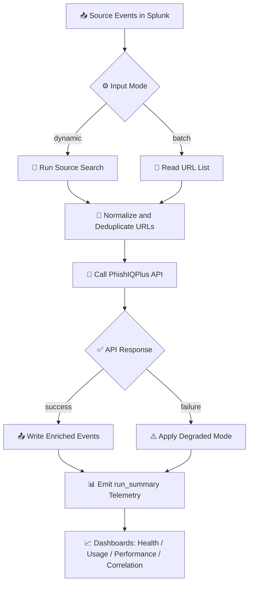

# PhishIQPlus Technical Add-on - Details

## 🔍 Overview

PhishIQPlus Technical Add-on enriches URL telemetry in Splunk with phishing intelligence from the PhishIQPlus API.  
It is built for SOC teams that need actionable phishing context during triage, correlation, and response.

The app supports:
- ⚡ Dynamic enrichment from live Splunk searches
- 📦 Batch enrichment for controlled onboarding/testing
- 🧠 URL risk scoring with confidence and source metadata
- 🛡️ Reliability controls (retry, backoff, circuit breaker)
- 🚀 Cache support to reduce repeated API calls
- 📊 Internal telemetry dashboards for health, usage, and performance

---

## 🧭 Enrichment Flow



---

## ✅ What the app adds to each event

Depending on response and mode, the app enriches with fields such as:

- `phishiq_prediction`
- `phishiq_confidence`
- `phishiq_risk_level`
- `phishiq_source`
- `phishiq_cached`
- `phishiq_domain`
- `phishiq_analysis_time`
- `phishiq_error` (if enrichment failed or degraded mode is active)

---

## ⚙️ Modes of operation

### Dynamic mode (recommended for production)
- Reads URLs from a Splunk search query (`Source Search`).
- Best for continuous SOC pipelines.
- Supports source-event context fields for correlation workflows.

### Batch mode
- Reads one URL per line from `URL List (batch)`.
- Best for onboarding, smoke tests, or controlled manual runs.

---

## 📊 Operational visibility

The add-on emits internal telemetry (`event_type=run_summary`) to:
- `index=phishiqplus_internal`
- `sourcetype=phishiqplus:internal`

This powers dashboards and key metrics:
- 🔢 URLs total / success / failed
- ⚡ Latency (`duration_ms`)
- ♻️ Cache hits
- 🔁 Retries and attempts
- ❗ Last error reason and status

---

## 🛡️ Reliability and safety controls

- Retry with exponential backoff for transient errors
- Circuit breaker for repeated upstream failures
- Configurable timeout and SSL verification
- Degraded mode behavior:
  - `emit_error_event`
  - `skip_event`

---

## 🔐 Security notes

- API keys are configured at runtime in Splunk input settings.
- Package defaults keep `api_key` empty by design.
- No encrypted/obfuscated code is required for normal operation.

---

## 🧪 Typical validation queries

### Internal run summaries
```spl
index=phishiqplus_internal sourcetype=phishiqplus:internal event_type=run_summary
| table _time stanza mode urls_total urls_success urls_failed cache_hits duration_ms reason client_metrics.last_error
| head 20
```

### Enriched events
```spl
index=main sourcetype=phishiq_enriched
| table _time url phishiq_prediction phishiq_source phishiq_confidence phishiq_risk_level phishiq_cached phishiq_error
| head 20
```

---

## 🧩 Platform context

PhishIQPlus integrates into enterprise detection and response programs and can operate alongside broader SOC tooling, including Microsoft Sentinel and Microsoft security services workflows.
