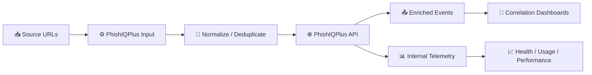

# PhishIQPlus Technical Add-on - Release Notes (v1.1.2)

## 🚀 Highlights

- ✅ Improved package compliance for Splunkbase and AppInspect.
- ✅ Added release automation scripts for consistent `.tgz` builds.
- ✅ Added richer Splunkbase documentation (Details, Installation, Troubleshooting).
- ✅ Strengthened runtime telemetry for better visibility in Health/Usage/Performance dashboards.
- ✅ Hardened package hygiene to remove hidden macOS artifacts and non-release files.

---

## 🛠️ What Changed

### 📦 Packaging and release process
- Added `scripts/build_release.sh` to build release artifacts in a repeatable way.
- Added `scripts/bump_version.sh` to safely update `version` and `build`.
- Build pipeline now automatically removes:
  - `._*` Apple metadata files
  - `.DS_Store`
  - `__pycache__`
  - `*.pyc`

### 🔐 Security and configuration defaults
- Package ships with `api_key =` placeholder (empty by design).
- API key must be configured by customer at install time.
- Added safeguards so plaintext API keys are not shipped in release artifacts.

### 📊 Telemetry and dashboards
- Improved run-summary telemetry behavior for reliability and operations visibility.
- Internal metrics continue to populate:
  - `urls_total`, `urls_success`, `urls_failed`
  - `cache_hits`
  - `duration_ms`
  - `client_metrics.*`

### ✅ AppInspect compliance
- Fixed custom command Python runtime declaration:
  - Added `python.version = python3` to `default/commands.conf`.

---

## 🧭 Runtime Flow (overview)



---

## 📌 Operational Notes

- Recommended production mode: `dynamic`.
- `Source Search (dynamic)` must return a valid URL field (for example: `url`).
- For smoke tests, use a temporary query that returns sample URLs, then replace with customer data-source search.

---

## 🧪 Validation Queries

### Internal run summaries
```spl
index=phishiqplus_internal sourcetype=phishiqplus:internal event_type=run_summary
| table _time stanza mode urls_total urls_success urls_failed cache_hits duration_ms reason client_metrics.last_error
| head 20
```

### Enriched events output
```spl
index=main sourcetype=phishiq_enriched
| table _time url phishiq_prediction phishiq_source phishiq_confidence phishiq_risk_level phishiq_cached phishiq_error
| head 20
```

---

## ⚠️ Known considerations

- If `reason=no_urls_found`, the configured `Source Search` is not returning valid URLs.
- Correlation dashboards require enriched events in the target index/sourcetype (not only internal telemetry).

