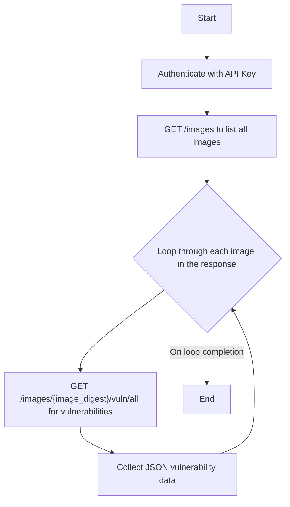

### API Flow for Fetching Image Vulnerabilities

This process involves two main API calls: first to list all the images known to Anchore, and second to retrieve the vulnerability report for each of those images.

#### **Authentication**

All API requests must be authenticated using HTTP Basic Authentication. You will use user name as ```-api_key`` and API key as the password.

---

### **Step 1: List All Images**

First, you need to get a list of all images that have been added to Anchore.

*   **API Endpoint**: `GET /images`
*   **Purpose**: To retrieve a list of summaries for all images in the system.
*   **Headers**:
    *   `x-anchore-account: <account_name>` (Account context)
*   **Optional Query Parameters**:
    *   `history`: Include image history (default: false)
    *   `detail`: Include detailed image information (default: false)
    *   `fulltag`: Filter by full image tag
*   **Response**: The response will be a JSON array. Each object in the array represents an image and contains details like the image digest (`image_digest`), which you will need for the next step.

**Example Response Snippet:**

```json
[
  {
    "image_digest": "sha256:f29b6cd...c1a2",
    "image_id": "a71555...2f5a",
    "analysis_status": "analyzed",
    ...
  },
  {
    "image_digest": "sha256:a1b2c3d...e4f5",
    "image_id": "b82666...3g6b",
    "analysis_status": "analyzed",
    ...
  }
]
```

---

### **Step 2: Get Vulnerabilities for Each Image**

Next, you will iterate through the list of images you received from Step 1. For each image, you'll make a separate API call to get its vulnerabilities.

*   **API Endpoint**: `GET /images/{image_digest}/vuln/all`
*   **Purpose**: To retrieve all types of vulnerabilities (OS, non-OS, etc.) for a specific image.
*   **Parameters**:
    *   `{image_digest}`: This is the `image_digest` value you obtained from the response in Step 1.
*   **Optional Query Parameters**:
    *   `base_digest`: Base image digest for comparison context
    *   `vendor_only`: Show only vendor data (default: true)
    *   `context`: Additional context for vulnerability assessment
*   **Headers**:
    *   `x-anchore-account: <account_name>` (Account context)
*   **Response**: The response will be a JSON object containing a list of vulnerabilities found in the specified image.

**Example Response Snippet:**

```json
{
  "image_digest": "sha256:f29b6cd...c1a2",
  "vulnerabilities": [
    {
      "vuln": "CVE-2023-1234",
      "package": "openssl-1.1.1k-r0",
      "severity": "High",
      ...
    },
    {
      "vuln": "CVE-2023-5678",
      "package": "python-3.9.7-r0",
      "severity": "Medium",
      ...
    }
  ]
}
```

---

### Flow Diagram Summary


