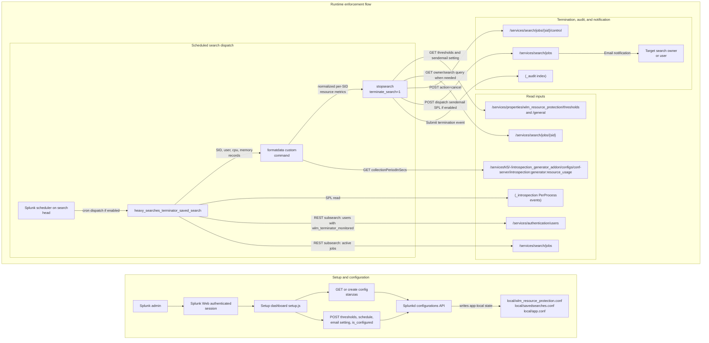

# Splunk WLM Resource Protection App ERD for ProdSec Review

This ERD covers the `wlm_resource_protection` Splunk app and its heavy search termination workflow.

## Scope

**In scope:**

- Splunk Web setup page for configuring thresholds, schedule, and email behavior.
- Saved search `[heavy_searches_terminator_saved_search]`.
- Custom search commands `formatdata` and `stopsearch`.
- Reads from `_introspection`, active search job metadata, authentication users, and app configuration.
- Writes to app-local configuration, search job control, notification search dispatch, and `_audit`.

**Out of scope:**

- Splunk platform authentication, scheduler internals, and mail server implementation.
- General Splunk Workload Management features outside this app.
- SMTP configuration used by Splunk `sendemail`.
- Operational assignment and lifecycle management of the `wlm_terminator_monitored` role after app installation.

## High-Level Diagram

## Main Use Cases and Dataflows

### 1. Admin configures the app

Who: A Splunk admin, or another user with app write permissions such as `admin` or `sc_admin`.

What: The admin opens `Apps > Manage Apps > Splunk WLM Resource Protection App > Set up`, enables or disables the saved search, sets its cron schedule and earliest time, chooses whether to send email, and configures CPU and memory thresholds.

Happy path:

1. The admin authenticates to Splunk Web.
2. Splunk Web loads `appserver/static/javascript/setup.js`.
3. The browser creates `splunkjs.Service(new splunkjs.SplunkWebHttp(), { owner: "nobody", app: "wlm_resource_protection", sharing: "app" })`.
4. The setup code reads or creates:
   `wlm_resource_protection.conf` stanzas `[thresholds]` and `[general]`, `savedsearches.conf` stanza `[heavy_searches_terminator_saved_search]`, and `app.conf` stanza `[install]`.
5. On save, the setup code writes threshold values, `sendemail`, `enableSched`, `cron_schedule`, `dispatch.earliest_time`, and `is_configured = true`.
6. The app reload trigger is invoked so the updated configuration becomes active.

Controls:

- Authentication is provided by Splunk Web and Splunkd.
- App metadata limits write access to `admin` and `sc_admin`.
- The setup UI validates thresholds as non-negative numbers or `inf`.
- The saved search ships disabled by default with `enableSched = 0`.
- Search head cluster replication for `wlm_resource_protection.conf` is enabled through `default/server.conf`.

### 2. Scheduled search evaluates active searches

Who: The Splunk scheduler dispatches the saved search after an admin enables it. The flow affects searches owned by users who have the `wlm_terminator_monitored` role.

What: The saved search finds active search jobs, calculates resource consumption per SID from `_introspection`, compares those metrics to configured thresholds, and terminates searches that exceed any threshold.

Happy path:

1. Splunk scheduler runs `[heavy_searches_terminator_saved_search]` on the configured cron schedule.
2. The SPL reads `_introspection` events where `component=PerProcess` and `data.process_type=search`.
3. The SPL excludes internal users `internal_observability` and `splunk-system-user`.
4. The SPL excludes internal apps `splunk_instance_monitoring`, `cloud-monitoring-console-summarizer`, and `wlm_resource_protection`.
5. A REST subsearch reads `/services/authentication/users` and keeps only users whose roles include `wlm_terminator_monitored`.
6. A REST subsearch reads `/services/search/jobs` and keeps only active jobs where `isDone=0`.
7. The SPL passes SID, CPU percentage, memory usage, and user into `formatdata`.
8. `formatdata` reads `collectionPeriodInSecs` from the introspection generator endpoint, defaulting to 10 seconds if unavailable.
9. `formatdata` normalizes local and remote SIDs, calculates CPU seconds and memory GiB-seconds, and emits per-SID metrics.
10. The saved search aggregates metrics by SID and passes them to `stopsearch terminate_search=1`.
11. `stopsearch` reads threshold values and the `sendemail` setting from `/services/properties/wlm_resource_protection`.
12. If a metric exceeds its configured threshold, `stopsearch` reads the search query from `/services/search/jobs/{sid}` before canceling the job.
13. If the upstream record does not contain a username, `stopsearch` reads the search owner from `/services/search/jobs/{sid}`.
14. `stopsearch` cancels the job through `POST /services/search/jobs/{sid}/control` with `action=cancel`.
15. If email is enabled, `stopsearch` reads the user's email address from `/services/authentication/users/{user}` and dispatches a Splunk `sendemail` search through `POST /services/search/jobs`.
16. `stopsearch` writes a termination event to `_audit` with source `heavy_searches_terminator` and sourcetype `wlm_resource_protection`.

Controls:

- Runtime API access uses the Splunk session token available to the scheduled search command runtime.
- The saved search scopes enforcement to users with `wlm_terminator_monitored`.
- Internal Splunk users and internal monitoring apps are excluded before termination logic.
- Threshold values default to `inf`, which disables termination until an admin configures finite limits.
- Invalid threshold values read by `stopsearch` are logged and treated as disabled for that threshold.
- User notification can be disabled with `[general] sendemail = false`.

## Authentication and Authorization Scope

User-facing administration is performed by authenticated Splunk users through Splunk Web. Configuration write access is limited by app metadata to `admin` and `sc_admin`.

The scheduled enforcement flow is service-level behavior inside a single Splunk deployment. It uses the scheduled search runtime token to read metadata and cancel over-threshold jobs. The exact effective privileges are determined by the saved search owner and Splunk platform authorization.

Authorization scope for affected users is implemented by role-based selection in the saved search: only users with `wlm_terminator_monitored` are considered. This role is defined in `default/authorize.conf`, but assigning it to monitored users remains an administrative responsibility.

## Data Classification

Highest expected classification: operational Splunk telemetry and user/job metadata, with possible escalation if the captured search query contains sensitive literals, customer identifiers, or secrets.

Data processed:

- Search SIDs.
- Splunk usernames and role membership used for targeting.
- Per-process CPU and memory usage from `_introspection`.
- Search job owner.
- Search query text for email notification.
- User email address.
- Termination reason and audit metadata.

Data stored:

- Thresholds and `sendemail` setting in `local/wlm_resource_protection.conf`.
- Saved search enablement and schedule in `local/savedsearches.conf`.
- App setup state in `local/app.conf`.
- Termination event in `_audit`.
- Operational logs from the custom commands.
- Notification email sent through Splunk `sendemail` when enabled.

## Credentials and Secrets

The app does not define app-owned outgoing credentials, API keys, or stored secrets.

Credentials and tokens used by the app:

- Splunk Web browser session for setup actions.
- Splunk search command runtime token for internal REST calls.
- Splunk mail configuration for `sendemail`, if enabled.

## Attack Surfaces and APIs

User-accessible surfaces:

- Splunk setup dashboard `default/data/ui/views/setup.xml`.
- Browser JavaScript `appserver/static/javascript/setup.js`.
- Custom SPL commands `formatdata` and `stopsearch`, exported at system scope in `metadata/default.meta`.
- Saved search `[heavy_searches_terminator_saved_search]`.

Internal Splunk APIs used:

| API or data source | Method | Caller | Purpose |
| --- | --- | --- | --- |
| Splunk configurations API | GET/POST | Setup dashboard | Read, create, and update app config, saved search config, and app setup state. |
| `_introspection` index | SPL search | Saved search | Read per-process search resource usage. |
| `/services/authentication/users` | REST via SPL subsearch | Saved search | Select users with `wlm_terminator_monitored`. |
| `/services/search/jobs` | REST via SPL subsearch | Saved search | Select active jobs. |
| `/servicesNS/-/introspection_generator_addon/configs/conf-server/introspection:generator:resource_usage` | GET | `formatdata` | Read introspection collection interval. |
| `/services/properties/wlm_resource_protection/thresholds` | GET | `stopsearch` | Read configured thresholds. |
| `/services/properties/wlm_resource_protection/general` | GET | `stopsearch` | Read `sendemail` setting. |
| `/services/search/jobs/{sid}` | GET | `stopsearch` | Read owner and search query for notification. |
| `/services/authentication/users/{user}` | GET | `stopsearch` | Read user email address. |
| `/services/search/jobs/{sid}/control` | POST | `stopsearch` | Cancel an over-threshold search. |
| `/services/search/jobs` | POST | `stopsearch` | Dispatch a `sendemail` search. |
| `_audit` index | Submit event | `stopsearch` | Record terminated search SID. |

## Security Review Notes and Open Questions

- Confirm which Splunk role owns and runs the scheduled search. It must have enough privilege to read `_introspection`, list active jobs, read job details, cancel targeted jobs, read user emails, dispatch `sendemail`, and write `_audit`.
- Confirm the operational process for assigning, reviewing, and removing `wlm_terminator_monitored` from monitored users.
- Confirm ordinary users cannot use the system-exported `stopsearch` command to cancel jobs outside the intended scheduled-search flow.
- Consider reducing sensitive logging in `sendEmailToUser`, because the current code logs the full dispatched `sendemail` search, including the recipient and message body containing the search query.
- Confirm whether including full search query text in notification emails is acceptable for the environments where the app will be deployed.
- Confirm whether browser-side SplunkJS configuration writes are sufficient, or whether stricter server-side validation is needed for cron syntax and threshold values.

## Source Files Reviewed

- `README.md`
- `README/wlm_resource_protection.conf.spec`
- `appserver/static/javascript/setup.js`
- `default/app.conf`
- `default/authorize.conf`
- `default/commands.conf`
- `default/data/ui/views/setup.xml`
- `default/savedsearches.conf`
- `default/server.conf`
- `default/wlm_resource_protection.conf`
- `metadata/default.meta`
- `bin/formatdata.py`
- `bin/stopsearch.py`
